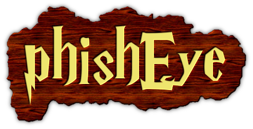
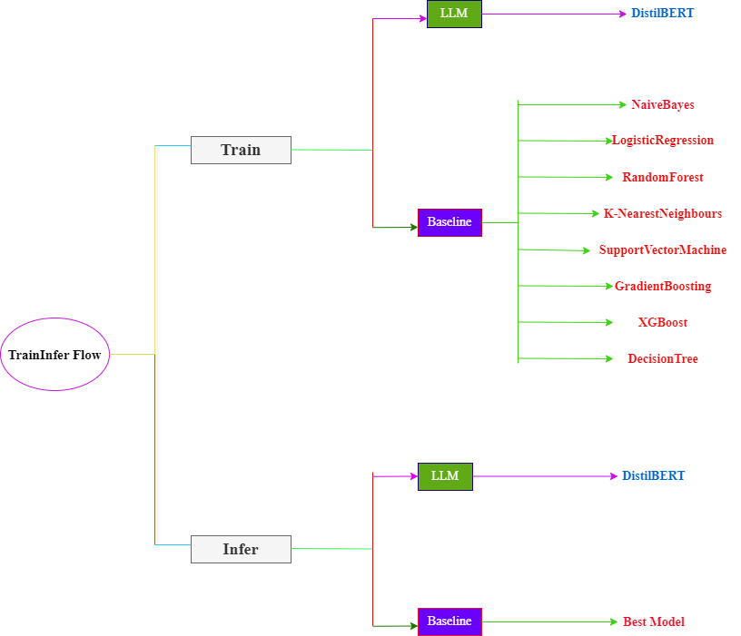
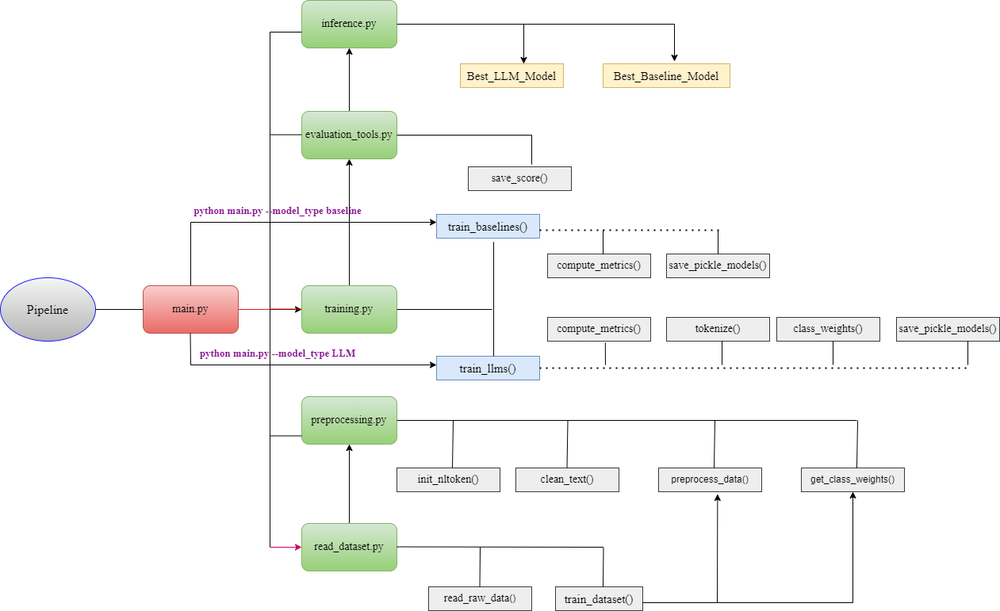
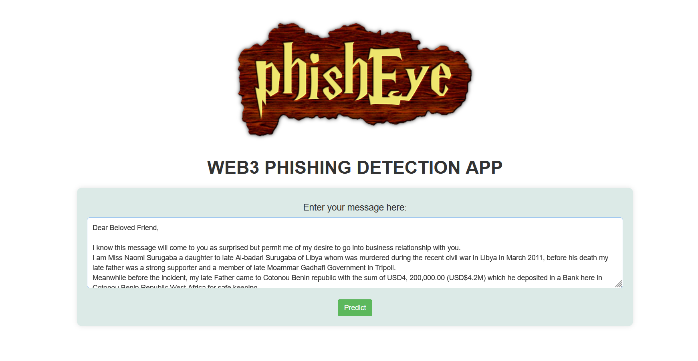
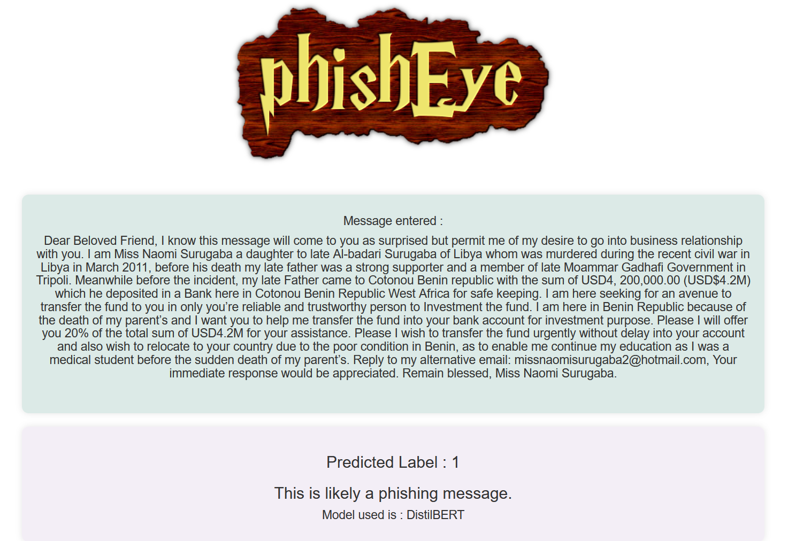

<p align="center">
    
</p>


## Introduction
PhishEYE aims to safeguard Web3 users by detecting and preventing phishing attacks that target their seed phrases and sensitive information. Leveraging a spam email dataset, PhishEYE utilizes both baseline machine learning models and advanced Large Language Model (LLM) techniques, specifically DistilBERT, to accurately identify and flag deceptive and fraudulent phishing messages.

This project focuses on classifying text messages into two categories: spam (1) and not spam (0). To achieve this, several machine learning models are trained using a CSV dataset containing a total of 5726 messages. Among these, 1368 messages are classified as spam (1), and 4358 messages are classified as not spam (0).


<p align="center">
    <br />
    <a href="src/figs/demo.gif">View Demo</a>
</p>

<!-- TABLE OF CONTENTS -->
<details>
  <summary>Table of Contents</summary>
  <ol>
    <li>
      <a href="#Pre-requisites">Features</a>
    </li>
    <li>
    <li>
      <a href="#Installations">Installation</a>
      <ul>
        <li><a href="#Window">Architecture</a></li>
        <li><a href="#Mac">ETL Process</a></li>
      </ul>
    </li>
      <a href="#Code Repo">Installation</a>
    </li>
    <li><a href="#Data Source">Data</a></li>
    <li>
       <a href="#Models Metric Benchmarks">Components</a>
    </li>
    <li><a href="#Pipeline">app.py</a></li>
    <li><a href="#Demo">Usage</a></li>
    <li><a href="#License">License</a></li>
  </ol>
</details>

## Pre-requisites


This file includes the requirements, as well as the steps you need to follow to run the PhishEye Flask app.

**Disclaimer**: Currently, the model is trained on 80% of the `emails.csv` and tested on the remaining 20%. The data is split internally within the script.

- To execute the training and testing pipeline, you will need the `emails.csv` dataset with the following specifications:
  - It is a CSV file with 2 columns: `Messages` and `spam`. `Messages` contains all phishing and non-phishing texts that will be fitted into the model, while `spam` contains 0 and 1 values for non-phishing and phishing respectively.
  - It must be located in the `/src/dataset/` directory.

- Ensure that your working directory is set to `/src/` to proceed with the pipeline.

## Installations

### Installing Python 3.11 and Upgrading pip

#### Windows
1. **Download and Install Python 3.11:**
   - Download the installer from the [official Python website](https://www.python.org/downloads/).
   - Run the installer and follow the instructions.

2. **Upgrade pip**:
   ```sh
   python -m pip install --upgrade pip
   ```

3. **Create a virtual environment**:
   ```sh
   python -m venv PhishEye
   ```

4. **Activate the virtual environment**:
   ```sh
   .\PhishEye\Scripts\activate
   ```

5. **Install dependencies**:
   ```sh
   pip install -r requirements.txt
   ```

6. **Change directory to go to src folder**:
   ```sh
   cd src
   ```
7. **Run the main file**:
   - For LLM:
     ```sh
     python main.py --model_type LLM
     ```
   - For Baseline:
     ```sh
     python main.py --model_type baseline
     ```

8. **Install Docker**:
   - Download and install Docker from the [official website](https://www.docker.com/products/docker-desktop).

9. **Build Docker image**:
   ```sh
   docker build -f Dockerfile -t phisheye .
   ```

10. **Run Docker container**:
   - For LLM:
     ```sh
     docker run -p 5000:5000 phisheye python app.py --model_type LLM
     ```
   - For Baseline:
     ```sh
     docker run -p 5000:5000 phisheye python app.py --model_type baseline
     ```
### Running the Application locally without Docker

   **Before running below code make sure you are outside scr folder(cd..)**
     ```sh
     python app.py --model_type LLM # or --model_type baseline
     ```


#### Mac

1. **Install Python 3.11**:
   - Download and install Python 3.11 from the [official website](https://www.python.org/downloads/).

2. **Upgrade pip**:
   ```sh
   python3 -m pip install --upgrade pip
   ```

3. **Create a virtual environment**:
   ```sh
   python3 -m venv PhishEye
   ```

4. **Activate the virtual environment**:
   ```sh
   source PhishEye/bin/activate
   ```

5. **Install dependencies**:
   ```sh
   pip install -r requirements.txt
   ```
6. **Change directory to go to src folder**:
   ```sh
   cd src
   ```

7. **Run the main file**:
   - For LLM:
     ```sh
     python main.py --model_type LLM
     ```
   - For Baseline:
     ```sh
     python main.py --model_type baseline
     ```
### Running the Application on Docker
8. **Install Docker**:
   - Download and install Docker from the [official website](https://www.docker.com/products/docker-desktop).

9. **Build Docker image**:
   ```sh
   docker build -f Dockerfile -t phisheye .
   ```

10. **Run Docker container**:
   - For LLM:
     ```sh
     docker run -p 5000:5000 phisheye python app.py --model_type LLM
     ```
   - For Baseline:
     ```sh
     docker run -p 5000:5000 phisheye python app.py --model_type baseline
     ```
### Running the Application locally without Docker

   **Before running below code make sure you are outside scr folder(cd..)**
     ```sh
     python app.py --model_type LLM # or --model_type baseline
     ```

## Code Repo

```plaintext
src/
├── dataset/
│   └── emails.csv
├── figs/
│   └── phisheye.png
├── outputs/
│   ├── model/
│   └── scores/
│       ├── baseline_experiment.csv
│       └── llm_experiment.csv
├── __init__.py
├── evaluation_tools.py
├── inference.py
├── main.py
├── preprocessing.py
├── read_dataset.py
├── training.py
templates/
├── index.html
└── prediction.html
.gitignore
app.py
Dockerfile
README.md
requirements.txt
```


## Data Source

The dataset used for training and testing the PhishEYE model is the Spam Email Dataset. This dataset is publicly available on Kaggle and can be downloaded from the following link:

[Spam Email Dataset on Kaggle](https://www.kaggle.com/datasets/jackksoncsie/spam-email-dataset?resource=download)

The downloaded dataset you can find in the `src/dataset/emails.csv` directory.


## Model Metric Benchmarks

| Model                | F1 Score | Precision | Recall | Accuracy | Training_Time (s) | Inference_Time (s) |
|----------------------|----------|-----------|--------|----------|-------------------|--------------------|
| NaiveBayes           | 0.8629   | 0.9639    | 0.7810 | 0.9407   | 0.0010            | 0.0                |
| LogisticRegression   | 0.9470   | 0.9843    | 0.9124 | 0.9756   | 0.0110            | 0.0                |
| RandomForest         | 0.9630   | 0.9774    | 0.9489 | 0.9825   | 2.0605            | 0.0150             |
| K-NearestNeighbours  | 0.9144   | 0.9127    | 0.9161 | 0.9590   | 0.0021            | 0.2714             |
| SupportVectorMachine | 0.9171   | 0.9257    | 0.9088 | 0.9607   | 1.1399            | 0.2554             |
| GradientBoosting     | 0.9403   | 0.9618    | 0.9197 | 0.9721   | 8.4309            | 0.0030             |
| XGBoost              | 0.9531   | 0.9429    | 0.9635 | 0.9773   | 1.5581            | 0.0020             |
| DecisionTree         | 0.8750   | 0.8815    | 0.8686 | 0.9407   | 0.2360            | 0.0                |
| DistilBERT           | 0.9817   | 0.9817    | 0.9817 | 0.9912   | 87969.9317          | 822.3969            |


## Pipeline
<p align="center">
    
    
</p>

## Demo Visual
<p align="center">
    
    
</p>

## License

<details>
  <summary>MIT License</summary>
  <p>
    MIT License

    Copyright (c) [2024] [Abhishek Singh]

    Permission is hereby granted, free of charge, to any person obtaining a copy
    of this software and associated documentation files (the "Software"), to deal
    in the Software without restriction, including without limitation the rights
    to use, copy, modify, merge, publish, distribute, sublicense, and/or sell
    copies of the Software, and to permit persons to whom the Software is
    furnished to do so, subject to the following conditions:

    The above copyright notice and this permission notice shall be included in all
    copies or substantial portions of the Software.

    THE SOFTWARE IS PROVIDED "AS IS", WITHOUT WARRANTY OF ANY KIND, EXPRESS OR
    IMPLIED, INCLUDING BUT NOT LIMITED TO THE WARRANTIES OF MERCHANTABILITY,
    FITNESS FOR A PARTICULAR PURPOSE AND NONINFRINGEMENT. IN NO EVENT SHALL THE
    AUTHORS OR COPYRIGHT HOLDERS BE LIABLE FOR ANY CLAIM, DAMAGES OR OTHER
    LIABILITY, WHETHER IN AN ACTION OF CONTRACT, TORT OR OTHERWISE, ARISING FROM,
    OUT OF OR IN CONNECTION WITH THE SOFTWARE OR THE USE OR OTHER DEALINGS IN THE
    SOFTWARE.
  </p>
</details>